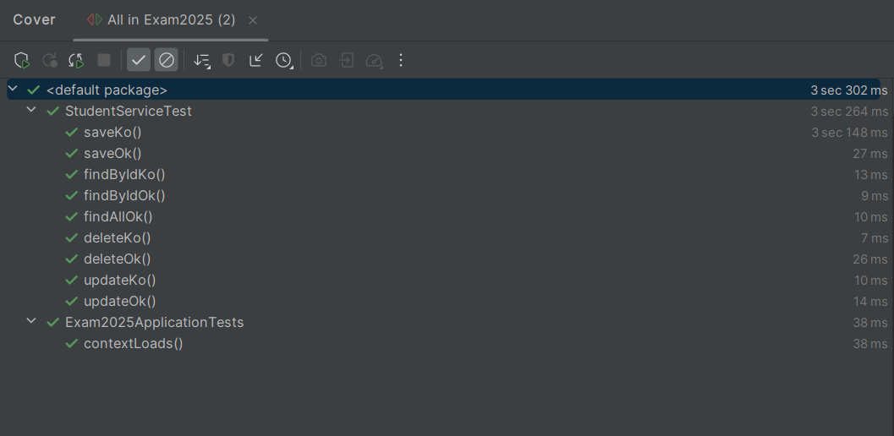

# MicroService

## Description
Ce projet Spring Boot, "Exam2025", est une application de gestion d'étudiants utilisant Spring Data JPA et H2 pour les tests. Il permet de gérer les étudiants (création, mise à jour, suppression, récupération) via des DTO mappés avec MapStruct. Des exceptions personnalisées gèrent les erreurs, et la documentation de l'API est générée avec Swagger. Des tests unitaires sont réalisés avec Mockito pour assurer la fiabilité du code, démontrant une approche moderne et robuste pour une application d'entreprise.

---

## Technologies utilisées

- **Base H2**
- **Spring Boot 3.4.2**
- **Spring Data JPA**
- **Spring Web**
- **Lombok**
- **Mapstruct**
- **Mockito**
- **OpenApi**

---

## Concepts Implémentés

- **CRUD Student**
- **Mapper, DTO**
- **Gestion des Exception [ NotFound, AlreadyExist ]**
- **Test Unitaire Junit**
- **Swagger**

###  Couverture des Teste



---

##  Installation et exécution

###  Configuration de la base de données
Nous avons utilisé une base de donnée embarquée H2 de type fichier
> data/exam2025.mv.db

## 🛠️ Open Api

L'application expose une API REST permettant de gérer une entité (ex. : `Contact`).
> **[ Acceder a swagger](http://localhost:8080/swagger-ui/index.html)**

### StudentEntity
```json
{
  "firstName": "Alph",
  "lastName": "Sy",
  "emailPro": "sy@malick",
  "emailPerso": "alpha@sy",
  "phoneNumber": "98659876",
  "address": "Hamo",
  "archive": true,
  "registrationNu": "LKJHJG7668"
}
```